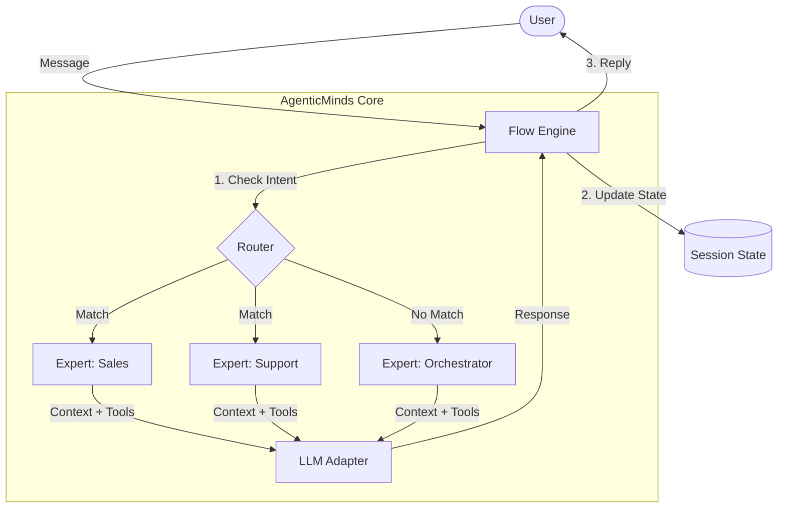

# AgenticMinds


A lightweight library for multi-persona AI agent routing and state management.

## Why AgenticMinds?

Building multi-agent systems often involves complex frameworks that are hard to debug and heavy to deploy. **AgenticMinds** is designed to be the opposite:
*   **Simple**: Minimal abstraction overhead.
*   **Flexible**: Define experts as simple Python objects.
*   **Transparent**: Full visibility into routing and state.
*   **Lightweight**: Perfect for embedding into existing applications.

## Features (v0.1)

*   **Flow**: Simple conversation management.
*   **Expert**: Define agents with specific personas and tools.
*   **Router**: Basic intent routing between experts.
*   **PNNet**: Tiny interface for memory optimization and context management.
*   **LLM Adapter**: Support for Gemini (and easy to extend).

## Story & Motivation

AgenticMinds exists to make multi-agent development *ridiculously fast*.  
Most agent frameworks either (a) force you to architect and wire everything from scratch, or (b) dump a huge, opinionated stack on your desk. AgenticMinds intentionally sits between: a tiny, composable routing + state layer that lets you assemble expert agents in minutes — but also provides the primitives you need to build robust production flows later.

We care about two developer problems:
1. **Speed of iteration** — get a working multi-expert agent in < 5 minutes.  
2. **Reasonable robustness** — sensible routing, context pruning, and performance trade-offs without the heavy lifting of full orchestration stacks.

## Robust routing — design trade-offs (latency vs multi-agent accuracy)

Routing in multi-agent systems is a trade-off between **latency** and **routing accuracy / specialization**. AgenticMinds uses a pragmatic approach that balances both:

- **Fast heuristic layer (v0.1)** — keyword/intent heuristics + simple fallback rules. Lowest latency; ideal for prototypes and low-variance user traffic.  
- **LLM-assisted lightweight routing (v0.2/0.3)** — use a small LLM adapter or embedding lookup to disambiguate when the heuristic is uncertain. Higher accuracy at slightly higher latency.  
- **Embedding-driven routing (v0.3)** — compute an embedding for the user request and route to the nearest expert profile (works well when you have many experts); trade-off: small embedding compute cost but more precise routing.  
- **Hybrid mode (recommended)** — run the fast heuristic first; only for ambiguous cases call the lightweight LLM/embedding router. This gives you the best of both worlds: most requests are routed instantly; ambiguous ones get the extra compute.

Implementation suggestions:
- Always cache routing decisions for short windows (context caching) to avoid repeating the same routing calls for repeated or similar queries.
- Add a confidence threshold: only call the expensive router when `confidence < T`. T is tunable per deployment.
- Track per-agent latency + success metrics (simple counters) so the system adaptively changes thresholds later.

This staged, hybrid strategy lets you scale agent count while keeping the common case low-latency.

## How AgenticMinds differs from existing solutions

- **Not a heavy orchestration platform** (e.g., compared to LangChain/CrewAI): AgenticMinds is intentionally a thin routing + state layer built for speed of development and pragmatic production readiness. It’s not trying to reimplement a whole pipeline ecosystem in v0.x.

- **Smaller surface area than “full agent frameworks”:** We trade off some advanced orchestration primitives early-on for better DX, smaller installs, and faster iteration cycles.

- **Hybrid routing-first approach:** Many libraries rely primarily on large LLM routing or heavy embedding costs. AgenticMinds ships a hybrid route-first design (heuristic → LLM/embedding fallback) to minimize latency while keeping routing accurate.

- **Designed for incremental adoption:** Start with simple keyword or persona-based flows; progressively enable embedding routing, tools, and storage as the product matures — you don’t need to rewrite the app to scale.

## How it Works



## Installation

```bash
pip install agenticminds
```

## Quick Start (No API Key Required)

You can test the flow logic immediately using the `MockLLM`.

```python
from agenticminds import Expert, Router, Flow
from agenticminds.llm import MockLLM

# 1. Setup Mock LLM with routing rules
llm = MockLLM(
    responses={"help": "I can help you!", "buy": "Great choice!"},
    routing_rules={"help": "support", "buy": "sales"},
    default_response="Hello! I am a simulated agent."
)

# 2. Define Experts
support = Expert(name="support", description="Technical help", system_prompt="...")
sales = Expert(name="sales", description="Sales help", system_prompt="...")

# 3. Create Flow
router = Router(experts=[support, sales], llm=llm)
flow = Flow(router=router, llm=llm)

# 4. Run
response = flow.process_turn("I need help")
print(f"Agent: {response.agent_name}") # Output: support
print(f"Response: {response.content}")
```

## Real-World Usage

To use with a real LLM (e.g., Gemini), simply switch the adapter:

```python
import os
from agenticminds.llm import GeminiLLM

llm = GeminiLLM(model_name="gemini-2.0-flash", api_key=os.getenv("GOOGLE_API_KEY"))
# ... rest is the same
```

## Advanced Examples

For a complex scenario involving an **Orchestrator** that switches "modes" (personas) based on intent, check out `advanced_example.py` in the repository.

## Contributing

We welcome contributions! Please see [CONTRIBUTING.md](CONTRIBUTING.md) for details.

## License

This project is licensed under the MIT License - see the [LICENSE](LICENSE) file for details.


